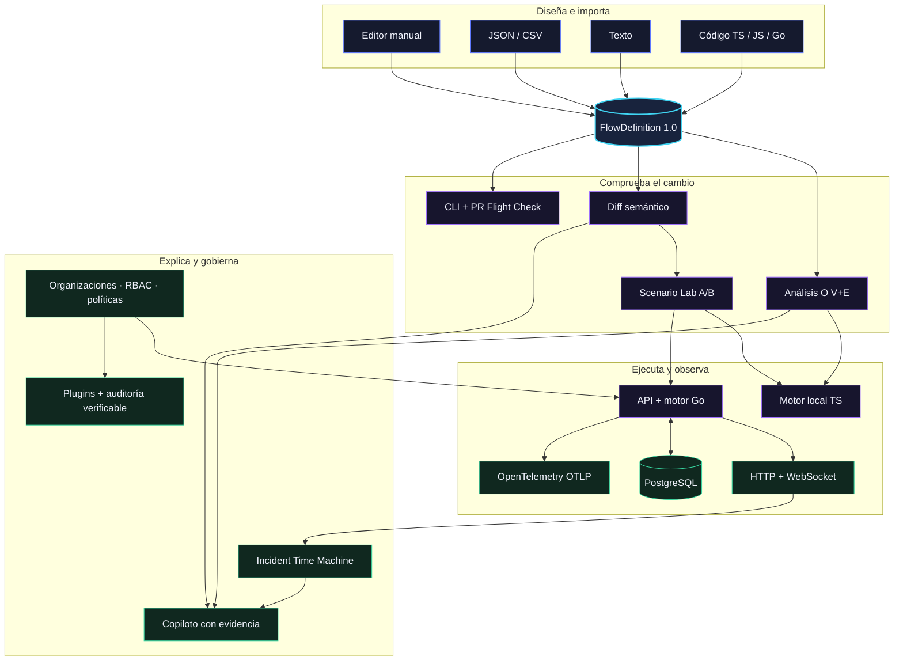

<p align="center">
  
</p>

<h1 align="center">FlowVerse 3D</h1>

<p align="center">
  <strong>Diseña el flujo. Rompe el escenario. Explica el resultado.</strong>
</p>

<p align="center">
  El laboratorio visual para modelar sistemas, comparar cambios y ensayar fallos<br />
  antes de que lleguen a producción.
</p>

<p align="center">
  <a href="https://github.com/AndrwGmez/Motor-de-Simulaci-n/actions/workflows/ci.yml">
    
  </a>
  
  
  
</p>

<p align="center">
  <a href="#producto">Producto</a> ·
  <a href="#laboratorio">Scenario Lab</a> ·
  <a href="#forense">Time Machine</a> ·
  <a href="#flight-check">CLI + CI</a> ·
  <a href="#gobierno">Enterprise</a> ·
  <a href="#codigo-a-universo">Código → universo</a> ·
  <a href="#arquitectura">Arquitectura</a> ·
  <a href="#inicio-rapido">Inicio rápido</a> ·
  <a href="#documentacion">Documentación</a>
</p>

<p align="center">
  
</p>

> [!IMPORTANT]
> **FlowVerse simula el comportamiento de un proceso.** No ejecuta código ni
> produce efectos en sistemas externos. Las integraciones, esperas y
> transformaciones se representan de forma segura dentro del motor.

<a name="producto"></a>

## De procesos complejos a universos que puedes explorar

FlowVerse reúne diseño, análisis, simulación y gobierno en un mismo contrato. Puedes
empezar desde un flujo inicial, importar JSON o CSV, describir un proceso en
lenguaje natural o derivar el grafo directamente desde código TypeScript,
JavaScript y Go.

| Etapa | Qué sucede |
|---|---|
| **01 · Construye** | Modela ocho tipos de nodo en 2D o 3D. |
| **02 · Compara** | Entiende el impacto real de cada cambio con diff semántico. |
| **03 · Experimenta** | Ejecuta escenarios A/B, fallos y rutas forzadas de forma determinista. |
| **04 · Investiga** | Reconstruye incidentes evento por evento con trazas correlacionadas. |
| **05 · Automatiza** | Convierte las reglas del flujo en un gate reproducible para cada PR. |
| **06 · Gobierna** | Aplica organizaciones, roles, políticas, plugins y auditoría verificable. |

<p align="center">
  <a href="./docs/assets/flowverse-editor.webp">
    
  </a>
</p>

<p align="center"><sub>Editor 3D · paleta, grafo, inspector, layouts y controles de ejecución</sub></p>

### Una superficie de trabajo, varias formas de entender el sistema

| Capacidad | Qué aporta |
|---|---|
| **Editor 2D/3D** | Paleta, inspector, undo/redo, autosave serializado y seis layouts: libre, direccional, capas, cronología, clústeres y ejecución. |
| **Entradas flexibles** | Edición manual, contrato JSON, CSV, propuesta desde texto y análisis estático de repositorios. |
| **Cambio seguro** | Versiones inmutables, diff semántico por identidad, impacto visual/conductual/ruptura y restauración con ETag. |
| **Scenario Lab** | Experimentos A/B reproducibles con presets, fallos inyectados, rutas forzadas, deltas y veredicto. |
| **Motor Go determinista** | Tiempo lógico, condiciones estructuradas, fan-out, joins `each`/`any`/`all`, ciclos acotados y mutaciones atómicas. |
| **Investigación forense** | Incident Time Machine, raíz probable, integridad del timeline y correlación con trazas OpenTelemetry. |
| **Copiloto con evidencia** | Recomendaciones ancladas a citas verificables del análisis, diff e incidente, sin enviar valores sensibles. |
| **Entrega continua** | CLI `validate`/`diff`/`simulate`/`check`, salidas humana, JSON y SARIF, más PR Flight Check. |
| **Gobierno empresarial** | Organizaciones, RBAC, configuración SSO, políticas deny-first, plugins con checksum y auditoría encadenada. |

<p align="center">
  <a href="./docs/assets/flowverse-dashboard.webp">
    
  </a>
</p>

<p align="center"><sub>Panel de proyectos en modo demo</sub></p>

### Un ciclo de ingeniería, no una captura del diagrama

| Pregunta | Superficie | Respuesta que entrega |
|---|---|---|
| ¿Este cambio altera el comportamiento? | **Diff semántico** | Entidades afectadas, impacto máximo y resumen estable. |
| ¿Qué pasa si falla esta dependencia? | **Scenario Lab** | Dos ejecuciones comparables, divergencia, rutas y deltas. |
| ¿Dónde empezó el incidente? | **Incident Time Machine** | Timeline reconstruido, causa probable, integridad y `traceId`. |
| ¿Debemos aceptar este cambio? | **Copiloto + Flight Check** | Evidencia citada para humanos y una política automática para CI. |

<a name="laboratorio"></a>

## Scenario Lab · prueba hipótesis antes de desplegar

El laboratorio ejecuta un control y un candidato bajo un plan explícito. Puedes
comparar borrador contra versión, cambiar entradas, forzar una conexión o
inyectar el fallo de un nodo. Como ambos lados usan el mismo motor determinista,
el resultado se puede reproducir exactamente.

- Presets para camino feliz, proveedor caído y rutas alternativas.
- Comparación A/B de estado, pasos, duración lógica, camino crítico y recorrido.
- Primera divergencia visible y conexiones añadidas o ausentes en cada ruta.
- Veredicto automático con límites de seguridad para evitar experimentos sin cota.
- Repetición exacta del plan desde el editor, sin rehacer la configuración.

El diff semántico complementa el experimento: ignora el orden accidental de los
arrays, conserva identidades estables y separa cambios `visual`, `behavioral` y
`breaking`. Una versión anterior se puede inspeccionar y restaurar como nuevo
borrador sin modificar la versión inmutable que le dio origen.

<a name="codigo-a-universo"></a>

## Código → universo

`@flowverse/codegraph` convierte la estructura de un repositorio al mismo
`FlowDefinition 1.0` que usa el editor. El resultado se puede importar,
validar, visualizar y analizar como cualquier otro flujo.

```bash
pnpm build:packages

node packages/codegraph/dist/cli.js ./mi-proyecto \
  --modo modules \
  --salida arquitectura.flow.json

# Go requiere indicar el lenguaje explícitamente
node packages/codegraph/dist/cli.js ./mi-servicio-go \
  --modo functions \
  --lenguaje go \
  --salida funciones-go.flow.json
```

| Modo | TypeScript / JavaScript | Go | Resultado |
|---|:---:|:---:|---|
| `modules` | ✓ | ✓ | Archivos y relaciones de importación |
| `functions` | ✓ | ✓ | Funciones y llamadas entre ellas |
| `journey` | ✓ | — | Recorrido de negocio desde una función exportada |

Para analizar Go, añade `--lenguaje go`; la detección automática todavía no
está implementada. Los filtros `--incluir` y `--excluir` permiten acotar
repositorios grandes en modo `functions`. El analizador clasifica
heurísticamente accesos a persistencia e integraciones externas y los traduce
a nodos del dominio visual.

## Una simulación que puedes detener y explicar

El motor procesa tokens en un orden total y reproducible. Las decisiones no
evalúan JavaScript: usan condiciones estructuradas. Las transformaciones de
contexto se preparan sobre una copia y se confirman de forma atómica.

- Tiempo lógico independiente de la velocidad de reproducción.
- Pausa, reanudación, avance paso a paso y cancelación.
- Ramas paralelas representadas sin carreras reales.
- Límites de pasos y visitas para contener ciclos.
- Eventos persistidos antes de emitirse por WebSocket en la pila completa.

El modo demo usa un simulador TypeScript simplificado. La semántica completa de
forks, joins, mutaciones atómicas y runtime persistido vive en la pila con API
Go.

<p align="center">
  <a href="./docs/assets/flowverse-simulation.webp">
    
  </a>
</p>

<p align="center"><sub>Simulación pausada · ruta activa, progreso, estado y controles visibles</sub></p>

<a name="forense"></a>

## Incident Time Machine · vuelve al instante exacto

Cada ejecución remota conserva una secuencia ordenada. Time Machine transforma
esa historia en una investigación navegable: mueve el scrubber, observa el
estado reconstruido de cada nodo, salta al origen probable y abre el elemento
implicado en el grafo.

La API verifica continuidad y orden antes de producir el informe. Si
OpenTelemetry está activo, el `traceId` une la ejecución con las trazas y
métricas exportadas por OTLP. El perfil opcional de Compose incluye un Collector
local para empezar sin acoplar FlowVerse a un proveedor concreto.

### Copiloto: conclusiones que se pueden comprobar

El copiloto no recibe un volcado del proceso. Primero se construye evidencia
mínima con identificadores, tipos, métricas, claves de configuración, análisis,
diff e incidente; se excluyen valores de configuración y payloads de entrada,
salida o eventos. Después, cada sugerencia se valida contra ese paquete:
citas inventadas y acciones fuera de alcance se descartan.

| El copiloto entrega | La interfaz permite |
|---|---|
| Hallazgos y limitaciones explícitas | Abrir la cita exacta que sustenta cada conclusión |
| Recomendaciones priorizadas | Seleccionar el nodo o conexión involucrados |
| Acciones acotadas y validadas | Abrir el nodo, la conexión o el incidente relacionado |
| Respuesta en el idioma de la pregunta | Distinguir evidencia disponible de inferencias |

El proveedor `mock` funciona sin red y hace reproducibles las pruebas. El
proveedor OpenAI es opcional, usa una salida estructurada estricta, desactiva el
almacenamiento de la respuesta y envía un identificador de seguridad derivado,
no el identificador interno del usuario.

<a name="flight-check"></a>

## Del editor al pull request

`@flowverse/cli` ejecuta las mismas reglas de contratos, diff y simulación sin
depender de una API. Está preparado para publicarse como paquete y también se
puede usar directamente desde este monorepo.

```bash
pnpm --filter @flowverse/cli build

node packages/cli/dist/cli.js validate flow.json
node packages/cli/dist/cli.js diff baseline.json candidate.json --json
node packages/cli/dist/cli.js simulate flow.json --input @scenario.json
node packages/cli/dist/cli.js check candidate.json \
  --baseline baseline.json \
  --fail-on behavioral \
  --sarif --output flowverse.sarif
```

El **PR Flight Check** incluido en `.github/actions/flowverse-flight-check`
puede bloquear errores de validación o cambios `behavioral`/`breaking`, y
producir SARIF 2.1.0 para code scanning. No recibe tokens ni secretos: el
workflow llamador decide si publica el artefacto.

<a name="arquitectura"></a>

## Arquitectura

Todas las entradas convergen en un contrato canónico. Esa frontera mantiene
desacoplados el editor, los motores, la API y los visores.



### Monorepo

| Ruta | Responsabilidad |
|---|---|
| [`apps/web`](apps/web) | Next.js, editor, dashboard, autenticación y experiencia 2D/3D |
| [`apps/api`](apps/api) | API Go, runtime, autenticación, persistencia y WebSocket |
| [`packages/core`](packages/core) | Modelo de dominio y flujo demo, sin dependencia de la aplicación |
| [`packages/engine`](packages/engine) | Validación, simulación local e importación CSV |
| [`packages/viewer`](packages/viewer) | Visores React 2D/3D, cámara, layouts y rendimiento |
| [`packages/codegraph`](packages/codegraph) | Análisis estático de TypeScript, JavaScript y Go |
| [`packages/cli`](packages/cli) | CLI publicable y PR Flight Check para automatización |
| [`packages/contracts`](packages/contracts) | JSON Schema, OpenAPI, AsyncAPI y fixtures canónicos |
| [`samples`](samples) | Flujos listos para importar y generadores de carga |

<a name="gobierno"></a>

## Gobierno empresarial sin cajas negras

El plano de control empresarial mantiene el aislamiento por organización desde
la consulta hasta la transacción. Los recursos ajenos se ocultan como no
encontrados y cada mutación se confirma junto con su evento de auditoría.

| Control | Garantía |
|---|---|
| **Organizaciones y miembros** | Roles `owner`, `admin`, `member` y `auditor`; nunca se puede eliminar el último owner activo. |
| **Proyectos** | La asociación exige administrar la organización y ser owner del proyecto. |
| **SSO** | Registro seguro de metadatos OIDC/SAML, dominios y huellas; no almacena secretos. |
| **Políticas** | Evaluación determinista, default-deny y precedencia explícita de `deny`; comodines acotados. |
| **Plugins** | Fuente, versión, capacidades y checksum SHA-256 por tenant; una revocación es irreversible. |
| **Auditoría** | Secuencia contigua y hash encadenado verificable, con la escritura dentro de la misma transacción del cambio. |

> [!NOTE]
> El control plane administra la configuración SSO, pero esta versión todavía
> no implementa el redirect/callback de login federado contra un IdP real. Las
> integraciones externas y sus secretos siguen siendo responsabilidad del
> despliegue que las habilite.

<a name="inicio-rapido"></a>

## Inicio rápido

### Pila completa con Docker

Solo necesitas Docker con Compose v2. La configuración trae valores
predeterminados locales para desarrollo, por lo que `.env` es opcional.

```bash
git clone https://github.com/AndrwGmez/Motor-de-Simulaci-n.git
cd Motor-de-Simulaci-n
docker compose up --build
```

| Servicio | URL |
|---|---|
| Aplicación | <http://localhost:3000> |
| API | <http://localhost:8080> |
| Readiness | <http://localhost:8080/health/ready> |

Detén los contenedores con `docker compose down`. El volumen de PostgreSQL se
conserva entre reinicios.

Para activar trazas y métricas OTLP junto con el Collector incluido:

```bash
OTEL_ENABLED=true docker compose --profile observability up --build
```

El receptor OTLP/HTTP queda en `127.0.0.1:4318`, OTLP/gRPC en
`127.0.0.1:4317` y la salud del Collector en `127.0.0.1:13133`. El perfil usa
el exportador `debug` como punto de partida; sustituirlo por el backend elegido
no requiere cambiar la instrumentación de la API.

### Demo del frontend, sin API

Requiere Node.js 24 y pnpm 10.15.0. En un checkout limpio, construye primero
los paquetes que consume la aplicación:

```bash
corepack enable
pnpm install --frozen-lockfile
pnpm build:packages
pnpm dev
```

Abre <http://localhost:3000>. Sin `NEXT_PUBLIC_API_URL`, FlowVerse activa el
modo demo con almacenamiento local y simulación en TypeScript.

<details>
<summary><strong>Ejecutar web y API localmente, sin PostgreSQL</strong></summary>

La API admite Go 1.23 o superior; CI y los contenedores del proyecto usan Go
1.26.
El store en memoria y el parser `mock` son los valores predeterminados.

```bash
# Terminal 1
cd apps/api
go run ./cmd/api
```

```bash
# Terminal 2, desde la raíz
NEXT_PUBLIC_API_URL=http://localhost:8080 \
NEXT_PUBLIC_WS_URL=ws://localhost:8080 \
pnpm dev
```

Los datos del store en memoria desaparecen al reiniciar la API.

</details>

<details>
<summary><strong>Activar el parser opcional con OpenAI</strong></summary>

El parser `mock` predeterminado es determinista y no usa la red. Con Compose,
puedes cambiar estas líneas en `.env`. Para ejecutar la API directamente,
expórtalas en la terminal antes de `go run`:

```bash
export FLOW_PARSER_PROVIDER=openai
export COPILOT_PROVIDER=openai
export OPENAI_API_KEY='sk-...'
export OPENAI_MODEL='gpt-4.1-mini' # opcional
export OPENAI_COPILOT_MODEL='gpt-4.1-mini' # opcional e independiente
```

El parser sigue devolviendo una previsualización validada que nunca se ejecuta
ni se persiste automáticamente. El copiloto devuelve únicamente sugerencias y
acciones acotadas; tampoco muta el flujo. El binario Go no carga archivos
`.env` por sí solo.

</details>

## Desarrollo y calidad

| Comando | Qué verifica |
|---|---|
| `pnpm contracts:check` | Esquemas, especificaciones y fixtures canónicos |
| `pnpm test` | Contratos, paquetes del workspace y web; `codegraph` requiere Go |
| `pnpm --filter @flowverse/cli test` | Comandos, políticas de salida y SARIF del CLI |
| `cd apps/api && go test ./...` | Suite de la API y del motor Go |
| `make test` | Contratos, API y web |
| `make test-all` | Lo anterior, race detector y E2E en modo demo |
| `make test-e2e-full` | Recorrido real con Compose, PostgreSQL, API y WebSocket |
| `make lint` | ESLint y `go vet` |
| `make build` | Paquetes, web y binario de la API |

Antes de las suites E2E, instala dependencias, construye los paquetes e instala
Chromium con `pnpm --filter @flowverse/web exec playwright install chromium`.
La suite full-stack también requiere Docker Compose.

La CI falla si no pasan contratos, lint, tipos, pruebas de paquetes, API o web,
el race detector, el umbral de cobertura del backend, los recorridos Playwright
o la construcción de las imágenes de contenedor.

### Diseñado para flujos grandes

- Contrato máximo: **5.000 nodos**, **10.000 conexiones** y **250 variables**.
- Fixture versionado: **482 nodos** y **1.000 conexiones**.
- Geometrías y materiales compartidos, instancing, etiquetas bajo demanda y
  nivel de detalle en el visor.

Consulta [`samples/README.md`](samples/README.md) para importar los ejemplos y
generar escenarios de escala.

## Seguridad por diseño

- Condiciones y transformaciones como datos estructurados; nunca `eval` ni
  JavaScript suministrado por el usuario.
- Salidas del parser normalizadas, validadas y presentadas como propuesta.
- Argon2id, tokens opacos, rotación de refresh, CSRF, CORS restringido y rate
  limits en la API.
- Autorización por proyecto y control de concurrencia mediante ETag.
- Versiones publicadas inmutables.
- Los enlaces públicos omiten los datos de entrada, salida y contexto de las
  ejecuciones.
- El copiloto minimiza la evidencia, descarta citas no verificadas y nunca
  recibe los valores de configuración ni los payloads de la ejecución.
- Las consultas empresariales están acotadas por tenant; las mutaciones y su
  auditoría encadenada se confirman atómicamente.
- Políticas con default-deny en el evaluador, revocación irreversible de
  plugins y protección concurrente del último owner activo.

<a name="documentacion"></a>

## Documentación

| Guía | Contenido |
|---|---|
| [Especificación técnica](docs/flowverse-3d-especificacion-tecnica.md) | Alcance, invariantes y arquitectura de referencia |
| [Contrato del flujo](docs/flow-contract.md) | Semántica de `FlowDefinition 1.0` |
| [Modelo de nodos](docs/node-model.md) | Tipos, puertos, configuración y reglas |
| [Motor de simulación](docs/simulation-engine.md) | Tiempo lógico, tokens, forks, joins y contexto |
| [Experiencia 3D](docs/3d-experience.md) | Interacción, cámara, layouts, accesibilidad y rendimiento |
| [API y tiempo real](docs/api-realtime.md) | Recursos HTTP, eventos y WebSocket |
| [Estrategia de pruebas](docs/testing.md) | Capas de prueba y escenarios full-stack |
| [CLI y PR Flight Check](packages/cli/README.md) | Comandos, SARIF, políticas y uso en GitHub Actions |
| [Operación de la API](apps/api/README.md) | Configuración productiva, OpenTelemetry y copiloto |
| [OpenAPI](packages/contracts/openapi.yaml) · [AsyncAPI](packages/contracts/asyncapi.yaml) | Contratos de integración |

## Estado del proyecto

La versión `0.1.0` implementa una vertical funcional de plataforma: diseño,
importación, análisis lineal, simulación, persistencia incremental, versionado,
diff y restauración; además incorpora Scenario Lab, investigación de incidentes,
OpenTelemetry, CLI/CI, copiloto con evidencia y el núcleo de gobierno
empresarial.

Las integraciones con efectos reales, la ejecución de código suministrado por
usuarios, el login federado completo, la colaboración simultánea, VR, BPMN y
un marketplace público permanecen fuera del alcance actual. El motor simula;
no actúa sobre sistemas de producción.

---

<p align="center">
  <strong>Diseña lo complejo. Simula lo crítico. Entiende el sistema.</strong>
</p>
