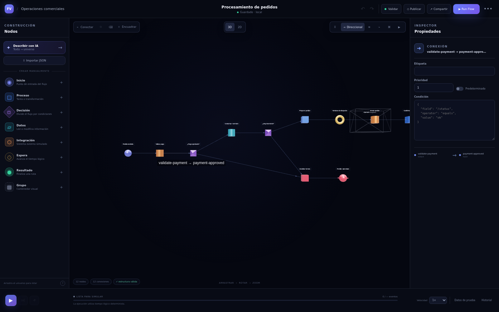
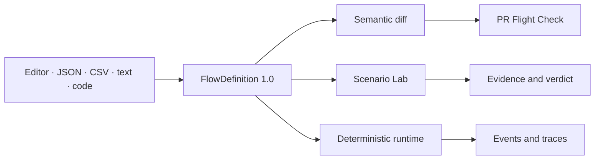

<div align="center">

# FlowVerse 3D

### Design the flow. Break the scenario. Explain the result.

**English documentation · [Leer en español](./README.es.md)**


The visual laboratory for modeling systems, comparing changes, and rehearsing failures before they reach production.

[Architecture](./docs/flowverse-3d-especificacion-tecnica.md) · [API and realtime](./docs/api-realtime.md) · [Simulation engine](./docs/simulation-engine.md)

</div>

> FlowVerse simulates process behavior. It does not execute application code or produce side effects in external systems.

<p align="center">
  
</p>

## Why it exists

FlowVerse gives engineering teams one contract for designing, analyzing, simulating, investigating, and governing complex workflows. Start from a visual editor, JSON, CSV, natural language, or a TypeScript, JavaScript, or Go codebase.

| Step | Outcome |
| --- | --- |
| **01 · Build** | Model eight node types in 2D or 3D. |
| **02 · Compare** | Understand the behavioral impact of a change with semantic diff. |
| **03 · Experiment** | Run deterministic A/B scenarios, injected failures, and forced routes. |
| **04 · Investigate** | Reconstruct incidents event by event with correlated traces. |
| **05 · Automate** | Turn flow rules into a reproducible PR gate with JSON and SARIF output. |
| **06 · Govern** | Apply organizations, roles, policies, plugins, and verifiable audit trails. |

## The product surface

<p align="center">
  
</p>

| Capability | What it delivers |
| --- | --- |
| **2D/3D editor** | Palette, inspector, undo/redo, serialized autosave, and six layouts. |
| **Scenario Lab** | Reproducible control/candidate runs, presets, failures, deltas, and verdicts. |
| **Deterministic engine** | Logical time, structured conditions, fan-out, joins, bounded cycles, and atomic mutations. |
| **Incident Time Machine** | Timeline reconstruction, probable root, integrity checks, and trace correlation. |
| **Code → universe** | Convert TypeScript, JavaScript, or Go structure into the canonical flow model. |
| **PR Flight Check** | Validate, diff, simulate, and fail CI on behavioral or breaking changes. |
| **Enterprise governance** | Multi-tenant organizations, RBAC, policies, plugins, and audit. |

## One canonical contract

Every input converges on `FlowDefinition 1.0`, keeping the editor, engines, API, CLI, and viewers decoupled.



## Technology

| Area | Stack |
| --- | --- |
| Web application | Next.js, React, TypeScript, Tailwind CSS |
| Visualization | Three.js, react-force-graph-3d, 2D/3D viewer package |
| Domain packages | TypeScript monorepo with Core, Engine, Viewer, CLI, Codegraph, and Contracts |
| API runtime | Go service with PostgreSQL, realtime WebSockets, and OpenTelemetry |
| Delivery | pnpm workspaces, Docker Compose |

## Repository map

```text
apps/web/       # Next.js editor, dashboard, simulation and sharing UI
apps/api/       # Go API, realtime events and persistence
packages/core/  # FlowDefinition domain model and semantic diff
packages/engine/# Validation, simulation and Scenario Lab
packages/viewer/# 2D/3D React visualization primitives
packages/cli/   # validate, diff, simulate and check commands
packages/codegraph/ # TypeScript/JavaScript/Go code analysis
packages/contracts/ # JSON Schema, OpenAPI and AsyncAPI contracts
docs/           # Architecture, runtime, 3D experience and testing
```

## Run locally

Requirements: Node.js 24, pnpm 10, Go, and Docker.

```bash
git clone https://github.com/AndrwGmez/Motor-de-Simulacion.git
cd Motor-de-Simulacion
pnpm install
cp .env.example .env
pnpm build
pnpm dev
```

The web app runs on the port configured in apps/web; the full stack can be started with Docker Compose. See [deployment](./DEPLOY.md) and the [API setup](./apps/api/README.md) for environment variables and database services.

## Useful commands

```bash
pnpm dev
pnpm build
pnpm lint
pnpm typecheck
pnpm test
pnpm test:e2e
pnpm check
```

Build the package toolchain before using the code graph or CLI:

```bash
pnpm build:packages
node packages/cli/dist/cli.js validate flow.json
node packages/cli/dist/cli.js diff baseline.json candidate.json --json
node packages/cli/dist/cli.js simulate flow.json --input @scenario.json
```

## Documentation

[3D experience](./docs/3d-experience.md) · [Flow contract](./docs/flow-contract.md) · [Simulation engine](./docs/simulation-engine.md) · [Realtime API](./docs/api-realtime.md) · [Enterprise API](./docs/enterprise-api.md) · [Testing](./docs/testing.md)

## License

UNLICENSED. Contact the repository owner for usage permissions.
