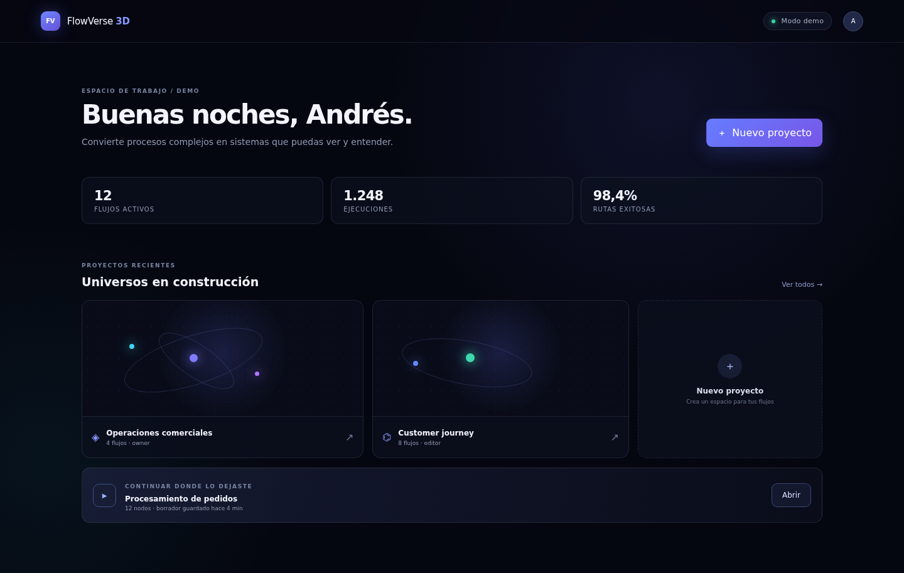
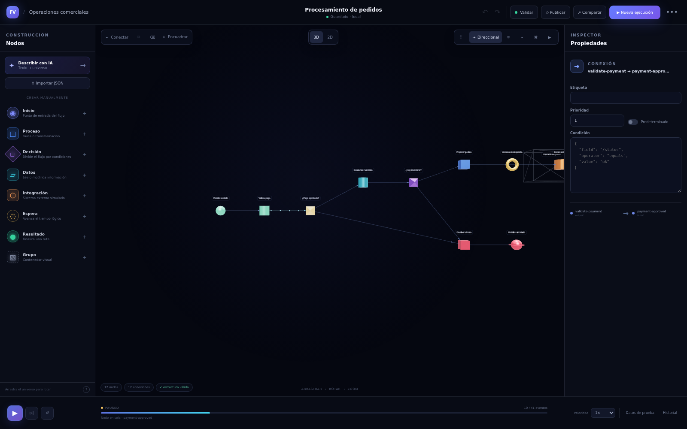
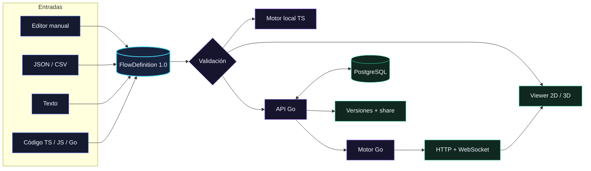

<p align="center">
  
</p>

<h1 align="center">FlowVerse 3D</h1>

<p align="center">
  <strong>Ve el flujo. Prueba el sistema.</strong>
</p>

<p align="center">
  Convierte procesos y código existente en universos 2D/3D editables.<br />
  Valida la ejecutabilidad del grafo, simula con tiempo lógico y observa cada evento.
</p>

<p align="center">
  <a href="https://github.com/AndrwGmez/Motor-de-Simulaci-n/actions/workflows/ci.yml">
    
  </a>
  
  
  
</p>

<p align="center">
  <a href="#producto">Producto</a> ·
  <a href="#codigo-a-universo">Código → universo</a> ·
  <a href="#arquitectura">Arquitectura</a> ·
  <a href="#inicio-rapido">Inicio rápido</a> ·
  <a href="#documentacion">Documentación</a>
</p>

<p align="center">
  
</p>

> [!IMPORTANT]
> **FlowVerse simula el comportamiento de un proceso.** No ejecuta código ni
> produce efectos en sistemas externos. Las integraciones, esperas y
> transformaciones se representan de forma segura dentro del motor.

<a name="producto"></a>

## De procesos complejos a universos que puedes explorar

FlowVerse reúne diseño, análisis y simulación en un mismo contrato. Puedes
empezar desde un flujo inicial, importar JSON o CSV, describir un proceso en
lenguaje natural o derivar el grafo directamente desde código TypeScript,
JavaScript y Go.

| Etapa | Qué sucede |
|---|---|
| **01 · Construye** | Modela ocho tipos de nodo en 2D o 3D. |
| **02 · Valida** | Detecta rutas rotas, ciclos, puertos inválidos y problemas semánticos. |
| **03 · Simula** | Recorre decisiones, forks, joins y fallos con tiempo lógico determinista. |
| **04 · Comprende** | Inspecciona eventos, métricas, camino crítico, versiones y resultados. |

<p align="center">
  <a href="./docs/assets/flowverse-editor.webp">
    
  </a>
</p>

<p align="center"><sub>Editor 3D · paleta, grafo, inspector, layouts y controles de ejecución</sub></p>

### Una superficie de trabajo, varias formas de entender el sistema

| Capacidad | Qué aporta |
|---|---|
| **Editor 2D/3D** | Paleta de nodos, inspector, undo/redo, autosave y seis layouts: libre, direccional, capas, cronología, clústeres y ejecución. |
| **Entradas flexibles** | Edición manual, contrato JSON, CSV, propuesta desde texto y análisis estático de repositorios. |
| **Validación y salud** | Alcanzabilidad, decisiones, ciclos, complejidad, rutas, profundidad y camino crítico. |
| **Motor Go determinista** | Tiempo lógico, condiciones estructuradas, fan-out, joins `each`/`any`/`all`, ciclos acotados y mutaciones atómicas. |
| **Observabilidad en vivo** | Eventos ordenados, pausa, reanudación, avance paso a paso, velocidad, cancelación, progreso y replay por secuencia. |
| **Publicación segura** | Roles por proyecto, versiones inmutables y enlaces públicos de solo lectura sin contextos privados. |

<p align="center">
  <a href="./docs/assets/flowverse-dashboard.webp">
    
  </a>
</p>

<p align="center"><sub>Panel de proyectos en modo demo</sub></p>

<a name="codigo-a-universo"></a>

## Código → universo

`@flowverse/codegraph` convierte la estructura de un repositorio al mismo
`FlowDefinition 1.0` que usa el editor. El resultado se puede importar,
validar, visualizar y analizar como cualquier otro flujo.

```bash
pnpm build:packages

node packages/codegraph/dist/cli.js ./mi-proyecto \
  --modo modules \
  --salida arquitectura.flow.json

# Go requiere indicar el lenguaje explícitamente
node packages/codegraph/dist/cli.js ./mi-servicio-go \
  --modo functions \
  --lenguaje go \
  --salida funciones-go.flow.json
```

| Modo | TypeScript / JavaScript | Go | Resultado |
|---|:---:|:---:|---|
| `modules` | ✓ | ✓ | Archivos y relaciones de importación |
| `functions` | ✓ | ✓ | Funciones y llamadas entre ellas |
| `journey` | ✓ | — | Recorrido de negocio desde una función exportada |

Para analizar Go, añade `--lenguaje go`; la detección automática todavía no
está implementada. Los filtros `--incluir` y `--excluir` permiten acotar
repositorios grandes en modo `functions`. El analizador clasifica
heurísticamente accesos a persistencia e integraciones externas y los traduce
a nodos del dominio visual.

## Una simulación que puedes detener y explicar

El motor procesa tokens en un orden total y reproducible. Las decisiones no
evalúan JavaScript: usan condiciones estructuradas. Las transformaciones de
contexto se preparan sobre una copia y se confirman de forma atómica.

- Tiempo lógico independiente de la velocidad de reproducción.
- Pausa, reanudación, avance paso a paso y cancelación.
- Ramas paralelas representadas sin carreras reales.
- Límites de pasos y visitas para contener ciclos.
- Eventos persistidos antes de emitirse por WebSocket en la pila completa.

El modo demo usa un simulador TypeScript simplificado. La semántica completa de
forks, joins, mutaciones atómicas y runtime persistido vive en la pila con API
Go.

<p align="center">
  <a href="./docs/assets/flowverse-simulation.webp">
    
  </a>
</p>

<p align="center"><sub>Simulación pausada · ruta activa, progreso, estado y controles visibles</sub></p>

<a name="arquitectura"></a>

## Arquitectura

Todas las entradas convergen en un contrato canónico. Esa frontera mantiene
desacoplados el editor, los motores, la API y los visores.



### Monorepo

| Ruta | Responsabilidad |
|---|---|
| [`apps/web`](apps/web) | Next.js, editor, dashboard, autenticación y experiencia 2D/3D |
| [`apps/api`](apps/api) | API Go, runtime, autenticación, persistencia y WebSocket |
| [`packages/core`](packages/core) | Modelo de dominio y flujo demo, sin dependencia de la aplicación |
| [`packages/engine`](packages/engine) | Validación, simulación local e importación CSV |
| [`packages/viewer`](packages/viewer) | Visores React 2D/3D, cámara, layouts y rendimiento |
| [`packages/codegraph`](packages/codegraph) | Análisis estático de TypeScript, JavaScript y Go |
| [`packages/contracts`](packages/contracts) | JSON Schema, OpenAPI, AsyncAPI y fixtures canónicos |
| [`samples`](samples) | Flujos listos para importar y generadores de carga |

<a name="inicio-rapido"></a>

## Inicio rápido

### Pila completa con Docker

Solo necesitas Docker con Compose v2. La configuración trae valores
predeterminados locales para desarrollo, por lo que `.env` es opcional.

```bash
git clone https://github.com/AndrwGmez/Motor-de-Simulaci-n.git
cd Motor-de-Simulaci-n
docker compose up --build
```

| Servicio | URL |
|---|---|
| Aplicación | <http://localhost:3000> |
| API | <http://localhost:8080> |
| Readiness | <http://localhost:8080/health/ready> |

Detén los contenedores con `docker compose down`. El volumen de PostgreSQL se
conserva entre reinicios.

### Demo del frontend, sin API

Requiere Node.js 24 y pnpm 10.15.0. En un checkout limpio, construye primero
los paquetes que consume la aplicación:

```bash
corepack enable
pnpm install --frozen-lockfile
pnpm build:packages
pnpm dev
```

Abre <http://localhost:3000>. Sin `NEXT_PUBLIC_API_URL`, FlowVerse activa el
modo demo con almacenamiento local y simulación en TypeScript.

<details>
<summary><strong>Ejecutar web y API localmente, sin PostgreSQL</strong></summary>

La API admite Go 1.23 o superior; CI y los contenedores del proyecto usan Go
1.26.
El store en memoria y el parser `mock` son los valores predeterminados.

```bash
# Terminal 1
cd apps/api
go run ./cmd/api
```

```bash
# Terminal 2, desde la raíz
NEXT_PUBLIC_API_URL=http://localhost:8080 \
NEXT_PUBLIC_WS_URL=ws://localhost:8080 \
pnpm dev
```

Los datos del store en memoria desaparecen al reiniciar la API.

</details>

<details>
<summary><strong>Activar el parser opcional con OpenAI</strong></summary>

El parser `mock` predeterminado es determinista y no usa la red. Con Compose,
puedes cambiar estas líneas en `.env`. Para ejecutar la API directamente,
expórtalas en la terminal antes de `go run`:

```bash
export FLOW_PARSER_PROVIDER=openai
export OPENAI_API_KEY='sk-...'
export OPENAI_MODEL='gpt-4.1-mini' # opcional
```

La respuesta sigue siendo una previsualización validada: nunca se ejecuta ni
se persiste automáticamente. El binario Go no carga archivos `.env` por sí
solo.

</details>

## Desarrollo y calidad

| Comando | Qué verifica |
|---|---|
| `pnpm contracts:check` | Esquemas, especificaciones y fixtures canónicos |
| `pnpm test` | Contratos, paquetes del workspace y web; `codegraph` requiere Go |
| `cd apps/api && go test ./...` | Suite de la API y del motor Go |
| `make test` | Contratos, API y web |
| `make test-all` | Lo anterior, race detector y E2E en modo demo |
| `make test-e2e-full` | Recorrido real con Compose, PostgreSQL, API y WebSocket |
| `make lint` | ESLint y `go vet` |
| `make build` | Paquetes, web y binario de la API |

Antes de las suites E2E, instala dependencias, construye los paquetes e instala
Chromium con `pnpm --filter @flowverse/web exec playwright install chromium`.
La suite full-stack también requiere Docker Compose.

La CI falla si no pasan contratos, lint, tipos, pruebas de paquetes, API o web,
el race detector, el umbral de cobertura del backend, los recorridos Playwright
o la construcción de las imágenes de contenedor.

### Diseñado para flujos grandes

- Contrato máximo: **5.000 nodos**, **10.000 conexiones** y **250 variables**.
- Fixture versionado: **482 nodos** y **1.000 conexiones**.
- Geometrías y materiales compartidos, instancing, etiquetas bajo demanda y
  nivel de detalle en el visor.

Consulta [`samples/README.md`](samples/README.md) para importar los ejemplos y
generar escenarios de escala.

## Seguridad por diseño

- Condiciones y transformaciones como datos estructurados; nunca `eval` ni
  JavaScript suministrado por el usuario.
- Salidas del parser normalizadas, validadas y presentadas como propuesta.
- Argon2id, tokens opacos, rotación de refresh, CSRF, CORS restringido y rate
  limits en la API.
- Autorización por proyecto y control de concurrencia mediante ETag.
- Versiones publicadas inmutables.
- Los enlaces públicos omiten los datos de entrada, salida y contexto de las
  ejecuciones.

<a name="documentacion"></a>

## Documentación

| Guía | Contenido |
|---|---|
| [Especificación técnica](docs/flowverse-3d-especificacion-tecnica.md) | Alcance, invariantes y arquitectura de referencia |
| [Contrato del flujo](docs/flow-contract.md) | Semántica de `FlowDefinition 1.0` |
| [Modelo de nodos](docs/node-model.md) | Tipos, puertos, configuración y reglas |
| [Motor de simulación](docs/simulation-engine.md) | Tiempo lógico, tokens, forks, joins y contexto |
| [Experiencia 3D](docs/3d-experience.md) | Interacción, cámara, layouts, accesibilidad y rendimiento |
| [API y tiempo real](docs/api-realtime.md) | Recursos HTTP, eventos y WebSocket |
| [Estrategia de pruebas](docs/testing.md) | Capas de prueba y escenarios full-stack |
| [OpenAPI](packages/contracts/openapi.yaml) · [AsyncAPI](packages/contracts/asyncapi.yaml) | Contratos de integración |

## Estado del proyecto

La versión `0.1.0` implementa una vertical funcional del MVP: diseño,
importación, análisis, simulación, persistencia, publicación y visualización.
Integraciones con efectos reales, ejecución de código, colaboración simultánea,
VR, BPMN y marketplace permanecen fuera del alcance actual.

---

<p align="center">
  <strong>Diseña lo complejo. Simula lo crítico. Entiende el sistema.</strong>
</p>
