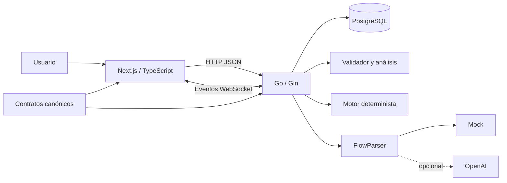

# FlowVerse 3D

## Especificación técnica del MVP

| Campo | Valor |
|---|---|
| Estado | Implementación inicial |
| Versión del documento | 1.0 |
| Versión del contrato | `schemaVersion: "1.0"` |
| Fecha | 30 de julio de 2026 |
| Producto | Constructor, simulador y analizador de flujos tridimensionales |

## 1. Visión

FlowVerse 3D convierte procesos estructurados o descritos en lenguaje natural en
un universo tridimensional editable. Una persona puede crear nodos, conectarlos,
validar el resultado, ejecutar una simulación determinista y revisar rutas,
errores, tiempos y cuellos de botella.

No es un mapa mental ni un ejecutor de automatizaciones. El MVP representa y
simula el comportamiento de un proceso sin enviar correos, cobrar pagos, llamar
APIs reales, modificar sistemas externos ni ejecutar código proporcionado por
el usuario.

### 1.1 Objetivos

- Crear flujos manualmente en un editor tridimensional.
- Importar JSON conforme al contrato de FlowVerse.
- Convertir texto a una propuesta de grafo revisable.
- Publicar versiones inmutables.
- Validar estructura y semántica antes de ejecutar.
- Simular decisiones, ramas, uniones, ciclos, esperas y fallos.
- Transmitir eventos persistidos en tiempo real.
- Analizar topología y ejecuciones.
- Compartir versiones publicadas en modo de solo lectura.

### 1.2 Fuera del MVP

- Ejecución de acciones externas reales.
- Colaboración simultánea y resolución CRDT.
- Importación CSV, BPMN o Mermaid.
- Marketplace, subflujos e integraciones empresariales.
- VR, AR y experiencia móvil de edición.
- Neo4j u otra base especializada en grafos.
- Recomendaciones de optimización generadas por IA.
- Recuperación o verificación de correo e invitaciones por email.

## 2. Criterio de producto terminado

El MVP está terminado cuando un usuario puede recorrer sin intervención manual
en la base de datos el siguiente escenario:

1. Registrarse e iniciar sesión.
2. Crear un proyecto y asignar un usuario ya registrado.
3. Crear un flujo manual o previsualizar uno importado/generado.
4. Editar nodos y conexiones en 3D, deshacer y guardar.
5. Resolver errores de validación.
6. Publicar una versión inmutable.
7. Ejecutarla con datos de prueba y observar eventos/partículas.
8. Pausar, reanudar, avanzar un nodo y cancelar.
9. Consultar análisis e historial.
10. Crear y revocar un enlace público sanitizado.

## 3. Arquitectura



### 3.1 Monorepo

```text
apps/web
apps/api
packages/contracts
docs
compose.yaml
```

- `apps/web`: Next.js, TypeScript y visualización Three.js mediante
  `react-force-graph-3d`.
- `apps/api`: Gin, PostgreSQL, autenticación, versionado, validación,
  simulación y WebSocket.
- `packages/contracts`: JSON Schema, OpenAPI, AsyncAPI y fixtures.
- `docs`: decisiones funcionales y técnicas.

Web y API mantienen Dockerfiles y ciclos de despliegue independientes. El
monorepo asegura que contratos y pruebas de compatibilidad evolucionen juntos.

### 3.2 Versiones de herramientas

- Node.js 24 LTS.
- pnpm 10.
- Go 1.26.
- PostgreSQL 17.
- OpenAPI 3.1 y AsyncAPI 3.0.
- JSON Schema Draft 2020-12.

Las imágenes y CI fijan estas familias de versiones; no dependen de herramientas
globales de la máquina del desarrollador.

## 4. Modelo del grafo

El flujo es un multigrafo dirigido:

- Cada nodo tiene un identificador único dentro del documento.
- Cada conexión referencia nodos y puertos existentes.
- Puede haber varias conexiones entre dos nodos.
- Se permiten ramas paralelas y ciclos.
- Los nodos desconectados se guardan durante la edición, pero generan aviso.
- Un documento puede contener varios triggers; cada run selecciona exactamente
  uno.
- Los grupos son únicamente visuales y no admiten conexiones ni ejecución.
- Cada ruta ejecutable debe poder alcanzar un nodo `end`.

Los límites de entrada son 5.000 nodos, 10.000 conexiones, 250 variables y 24 MB de
JSON.

### 4.1 Tipos de nodo

| Tipo | Función | Forma |
|---|---|---|
| `trigger` | Inicia la ejecución seleccionada | Esfera |
| `process` | Tarea con duración y operaciones controladas | Cubo |
| `decision` | Selecciona una o varias salidas | Diamante |
| `data` | Aplica `set`, `copy` o `delete` al contexto | Cilindro |
| `integration` | Respuesta externa completamente simulada | Hexágono |
| `delay` | Avanza el reloj lógico | Anillo |
| `end` | Termina una rama con éxito o fallo | Esfera sólida |
| `group` | Contenedor visual transparente | Caja transparente |

Todos incluyen puertos, `activationMode`, duración, configuración discriminada,
posición 3D y bloqueo. El detalle se encuentra en
[node-model.md](node-model.md).

### 4.2 Variables, condiciones y operaciones

Las variables se declaran con una ruta JSON Pointer y un tipo. Toda lectura o
escritura debe apuntar a una variable declarada. Las comparaciones son estrictas
por tipo.

Las condiciones forman un AST de datos:

- Comparación: `equals`, `not_equals`, `greater_than`,
  `greater_than_or_equal`, `less_than`, `less_than_or_equal`, `contains` y
  `not_contains`.
- Existencia: `exists`, `not_exists`.
- Composición: `and`, `or`.

No se aceptan scripts, expresiones evaluables, plantillas ejecutables ni
funciones enviadas por el cliente.

## 5. Creación e importación

### 5.1 Editor manual

Permite crear, duplicar, mover, bloquear y eliminar nodos; crear o eliminar
conexiones por puertos; agrupar; multiseleccionar; buscar; encuadrar; cambiar
layout; deshacer y rehacer.

El historial local conserva las últimas 100 operaciones sobre el documento. No
incluye selección, hover, cámara ni estado efímero de simulación.

### 5.2 Importación JSON

La importación:

1. Rechaza cuerpos mayores de 1 MB.
2. Analiza JSON sin ejecutar contenido.
3. Valida Draft 2020-12.
4. Normaliza únicamente campos con reglas explícitas.
5. Ejecuta validación semántica.
6. Devuelve una previsualización y un informe.
7. Persiste solo tras confirmación del usuario.

### 5.3 Lenguaje natural

`FlowParser` tiene implementaciones `mock` y `openai`. Ambas devuelven una
propuesta estructurada, advertencias, ambigüedades y proveedor. La propuesta se
normaliza y valida como cualquier importación.

El proveedor nunca guarda directamente un flujo. Un rechazo, timeout, respuesta
incompleta o documento inválido conserva el texto del usuario y devuelve un
error recuperable.

## 6. Experiencia tridimensional

La pantalla principal se divide en:

- Paleta/entrada textual a la izquierda.
- Universo 3D central.
- Inspector a la derecha.
- Controles y timeline de simulación en la zona inferior.
- Vista accesible alternativa de lista/árbol.

Interacciones principales:

- Clic selecciona; doble clic enfoca.
- Arrastre de nodo cambia posición.
- Arrastre de fondo orbita la cámara.
- Rueda acerca o aleja.
- Modificador más clic crea multiselección.
- Puertos visibles permiten crear conexiones.
- Escape cancela la acción en curso.
- Atajos de teclado cubren duplicar, eliminar, deshacer, rehacer y encuadrar.

### 6.1 Layouts

| Modo | Regla |
|---|---|
| `force` | Física tridimensional hasta estabilizar |
| `directional` | Grafo condensado de izquierda a derecha |
| `layers` | Profundidad topológica en el eje Z |
| `timeline` | Dependencias y duración lógica |
| `clusters` | Categoría, tipo o grupo |
| `execution` | Atenúa lo ajeno a la ruta seleccionada |

Los ciclos se condensan en componentes fuertemente conexas antes de calcular
layouts jerárquicos. Los layouts deterministas se ejecutan en Web Worker y no
modifican conexiones.

### 6.2 Estados visuales

| Estado | Tratamiento |
|---|---|
| `idle` | Color base |
| `queued` | Contorno amarillo |
| `waiting` | Pulso naranja |
| `running` | Brillo azul |
| `success` | Verde y marca de éxito |
| `failed` | Rojo y marca de error |
| `skipped` | Gris atenuado |

El color nunca es la única señal. El modo de movimiento reducido elimina pulsos
y transiciones no esenciales. Más detalle en
[3d-experience.md](3d-experience.md).

## 7. Persistencia y versionado

PostgreSQL es la fuente de verdad. `FlowDefinition` se guarda como JSONB para
evitar una representación relacional duplicada que pueda divergir.

Tablas principales:

| Tabla | Responsabilidad |
|---|---|
| `users` | Identidad y contraseña derivada |
| `auth_sessions` | Tokens opacos, rotación y revocación |
| `projects` | Espacio de trabajo |
| `project_members` | Rol por proyecto |
| `flows` | Identidad permanente y borrador |
| `flow_versions` | Snapshots publicados inmutables |
| `runs` | Estado y snapshot/checksum ejecutado |
| `node_runs` | Resultado de cada visita |
| `run_events` | Eventos ordenados y reproducibles |
| `share_links` | Hash del token público y alcance |
| `audit_logs` | Acciones sensibles |

### 7.1 Borradores

- Cada flujo tiene un borrador activo.
- El cliente guarda con debounce enviando el documento completo.
- La API entrega un ETag fuerte.
- La actualización exige `If-Match`.
- Si cambió en otra pestaña, responde `412`.
- La UI mantiene la copia local y permite recargar o exportarla.

### 7.2 Publicación

- Publicar valida otra vez el borrador.
- Una versión recibe número incremental y checksum.
- El snapshot publicado no se modifica.
- Editar después de publicar continúa sobre el borrador.
- Cada ejecución referencia una versión o conserva snapshot y checksum exactos.

## 8. Motor de simulación

La simulación es determinista: el mismo snapshot, trigger, input, overrides y
límites producen el mismo orden lógico, ruta y resultado.

El scheduler ordena unidades por:

1. Tiempo lógico.
2. Prioridad de conexión.
3. Identificador de nodo.
4. Identificador de token.

Una salida múltiple no condicional crea ramas. Una decisión usa `first_match` o
`all_matches`. La ruta default solo se usa cuando ninguna condición coincide.

### 8.1 Modos de activación

- `each`: ejecuta una visita por cada token entrante.
- `any`: la primera rama hermana que llega continúa; las demás se omiten.
- `all`: espera todos los tokens del fork correspondiente y combina contextos.

Dos ramas que escriben valores diferentes en la misma ruta producen
`context.merge_conflict`. No se elige un valor silenciosamente.

### 8.2 Ciclos y límites

- Máximo predeterminado: 10.000 pasos.
- Máximo predeterminado: 100 visitas por nodo.
- Al excederlos se emite `run.limit_exceeded` y el run falla de forma
  controlada.
- `delay` e `integration.latencyMs` avanzan tiempo lógico; no bloquean un hilo
  durante períodos extensos.

### 8.3 Controles

- Pausar termina primero la transición atómica actual.
- Reanudar continúa la cola existente.
- Step completa exactamente una visita y vuelve a pausa.
- Velocidad cambia solo el ritmo visual, nunca tiempos ni orden lógico.
- Cancelar termina el run sin borrar eventos.
- Reiniciar crea un run nuevo con la misma entrada.
- Overrides fuerzan una conexión o fallo de nodo sin introducir código.

El diseño completo se documenta en
[simulation-engine.md](simulation-engine.md).

## 9. Eventos y tiempo real

Cada evento se persiste antes de publicarse y contiene:

```json
{
  "schemaVersion": "1.0",
  "type": "node.started",
  "runId": "02fbd9ba-8dd8-4f61-93be-845f067370f9",
  "sequence": 12,
  "occurredAt": "2026-07-30T20:00:00Z",
  "logicalTimeMs": 2400,
  "payload": {
    "nodeId": "validate-payment",
    "tokenId": "token-1"
  }
}
```

Eventos:

- `run.started`
- `node.queued`
- `node.started`
- `node.waiting`
- `edge.traversed`
- `node.completed`
- `node.failed`
- `node.skipped`
- `run.paused`
- `run.resumed`
- `run.completed`
- `run.failed`
- `run.limit_exceeded`
- `run.cancelled`
- `run.interrupted`

El cliente obtiene primero un ticket de un solo uso y abre WebSocket con
`afterSequence`. El servidor reproduce los eventos posteriores y luego continúa
en vivo. El cliente deduplica por `(runId, sequence)`.

El MVP opera con una instancia de API. Si se reinicia, los runs activos pasan a
`interrupted`; no se intenta reconstruir una goroutine perdida.

## 10. Validación

JSON Schema resuelve forma, tipos y límites. El backend añade invariantes de
grafo que no pueden expresarse de manera mantenible en el esquema.

### 10.1 Errores bloqueantes

- Trigger seleccionado inexistente.
- Identificador duplicado.
- Referencia de nodo o puerto inexistente.
- Conexión desde/hacia `group`.
- Operación sobre variable no declarada.
- Tipo u operador incompatible.
- Decisión sin salida default o con más de una.
- Decisión sin salidas condicionadas.
- Ningún `end` alcanzable.
- Ciclo sin salida demostrable.
- Join `all` que no puede recibir todas las ramas esperadas.
- Configuración incompleta.

### 10.2 Advertencias

- Nodo desconectado o inaccesible.
- Ciclo con salida potencial.
- Fan-in/fan-out elevado.
- Complejidad ciclomática elevada.
- Etiqueta, descripción o categoría poco clara.
- Más de 100 rutas posibles; la enumeración se truncará.

Los issues usan `code`, `severity`, `message`, `path`, `nodeId` y `edgeId`.
El texto humano puede cambiar; las pruebas y la UI deben depender de `code`.

## 11. Análisis

La primera versión calcula:

- Número de nodos y conexiones.
- Nodos desconectados e inaccesibles.
- Componentes fuertemente conexas y ciclos.
- Profundidad del grafo condensado.
- Complejidad ciclomática.
- Fan-in y fan-out.
- Rutas posibles, limitadas a 100.
- Cobertura y ruta real por ejecución.
- Tiempo lógico total y por nodo.
- Cuellos de botella.
- Camino crítico estático para grafos acíclicos.

En grafos cíclicos el camino crítico estático se marca como no aplicable; nunca
se presenta una cifra engañosa. Sí se muestra la ruta y duración observadas.

## 12. API

La especificación ejecutable está en
[`packages/contracts/openapi.yaml`](../packages/contracts/openapi.yaml).

Grupos de recursos:

- `/v1/auth/*`
- `/v1/projects*` y miembros
- `/v1/projects/{projectId}/flows`
- `/v1/flows/{flowId}` y borrador
- `/v1/flow-versions/{versionId}` con validación/análisis
- `/v1/flows/import` y `/v1/flows/parse-text`
- `/v1/runs/{runId}` con controles, eventos y ticket WebSocket
- `/v1/flows/{flowId}/share-links`
- `/public/v1/shares/{token}`

Las mutaciones del borrador usan ETag; crear runs exige `Idempotency-Key`. Los
errores HTTP comparten `code`, `message`, `requestId` y `details`.

## 13. Autenticación, permisos y seguridad

### 13.1 Sesión

- Contraseñas con Argon2id.
- Access y refresh tokens opacos en cookies `HttpOnly`.
- Refresh rotatorio; reutilizar uno anterior revoca la familia.
- Protección CSRF mediante token de doble envío.
- Cookies `Secure` fuera de desarrollo y `SameSite` explícito.
- Logout revoca la sesión y elimina cookies.

### 13.2 Roles

| Rol | Capacidades |
|---|---|
| `owner` | Proyecto, miembros, shares y control completo |
| `editor` | Flujos, borradores, publicación, análisis y simulación |
| `viewer` | Lectura de flujos, análisis e historial |

Cada consulta filtra por proyecto; un UUID conocido no concede acceso.

### 13.3 Controles adicionales

- CSP y escape de etiquetas.
- Límite de solicitudes para auth e IA.
- Validación estricta de JSON y tamaño.
- Secretos solo en backend.
- Auditoría de miembros, publicación, shares y autenticación sensible.
- Tokens públicos aleatorios; solo se almacena su hash.
- Shares omiten inputs, outputs y contextos; muestran ruta, estados, tiempos y
  errores sanitizados.

## 14. Rendimiento y accesibilidad

Objetivo de referencia:

- 5.000 nodos y 10.000 conexiones como tope del contrato. El objetivo de
  navegación fluida se mide sobre 500 nodos y 1.000 conexiones; por encima de
  esa cifra el editor sigue siendo utilizable pero deja de ser interactivo en
  equipos modestos.
- Al menos 30 FPS al navegar después de estabilizar física.
- Validación y análisis bajo 500 ms.
- 10.000 pasos sin pacing bajo 2 s.

Técnicas:

- Etiquetas por nivel de detalle.
- Suspensión de física estable.
- Instancias/materiales compartidos.
- Límite de partículas simultáneas.
- Aplicación incremental de eventos.
- Cálculos de layout en Worker.
- Paneles cargados bajo demanda.
- Frustum culling y reducción de geometría lejana.

La vista lista/árbol, navegación por teclado, foco visible, texto asociado,
contraste AA y señales redundantes permiten operar funciones esenciales sin
depender del canvas o del color.

## 15. Observabilidad

Logs JSON con `requestId`, usuario cuando corresponda, recurso, latencia, código
y resultado. Nunca incluyen contraseñas, cookies, tokens o contexto completo del
run.

Métricas:

- Solicitudes, latencia y errores HTTP.
- Conexiones WebSocket y replay.
- Runs iniciados, completados, fallidos, cancelados e interrumpidos.
- Pasos y duración lógica/física.
- Tamaño de grafos.
- Fallos de importación y parser.
- Latencia de PostgreSQL.

Endpoints `/health/live` y `/health/ready` separan vida del proceso y
disponibilidad de dependencias.

## 16. Pruebas

Cada fase entrega código y pruebas; no existe una fase final para “añadirlas”.

- Unitarias: condiciones, operaciones, validador, algoritmos y scheduler.
- Integración: PostgreSQL, auth, permisos, ETag, idempotencia y WebSocket.
- Frontend: store, historial, formularios, reducer de eventos y layouts.
- E2E: registro, edición 3D, publicación, simulación y share.
- Seguridad negativa: CSRF, aislamiento, tokens revocados y contenido malicioso.
- Rendimiento: fixture determinista 500/1.000.

Objetivos de cobertura:

- 90% en condiciones, validación y simulación.
- 80% global de backend.
- 85% de lógica frontend no visual.

La estrategia y matriz completa están en [testing.md](testing.md).

## 17. Decisiones cerradas

| Tema | Decisión |
|---|---|
| Grafo | Multigrafo dirigido |
| Persistencia de definición | JSONB canónico |
| Base de datos | PostgreSQL |
| Ejecución | Simulada y determinista |
| Código de usuario | Prohibido |
| Tiempo real | WebSocket con replay persistido |
| Editor | Next.js + Three.js mediante adaptador |
| Backend | Go + Gin |
| Versiones | Publicadas e inmutables |
| Concurrencia de edición | ETag, no colaboración simultánea |
| IA local/pruebas | Proveedor mock |
| IA opcional | OpenAI detrás de `FlowParser` |
| UI | Español con base preparada para i18n |
| Dispositivo objetivo | Escritorio moderno |

## 18. Referencias normativas del repositorio

En caso de divergencia:

1. Los JSON Schema mandan sobre la forma del documento.
2. OpenAPI manda sobre HTTP.
3. AsyncAPI y `run-event.schema.json` mandan sobre WebSocket.
4. Los documentos especializados mandan sobre comportamiento.
5. Esta especificación resume el conjunto.

Todo cambio incompatible incrementa `schemaVersion` y aporta migración,
fixtures y pruebas. Una versión publicada nunca se reinterpreta silenciosamente.

